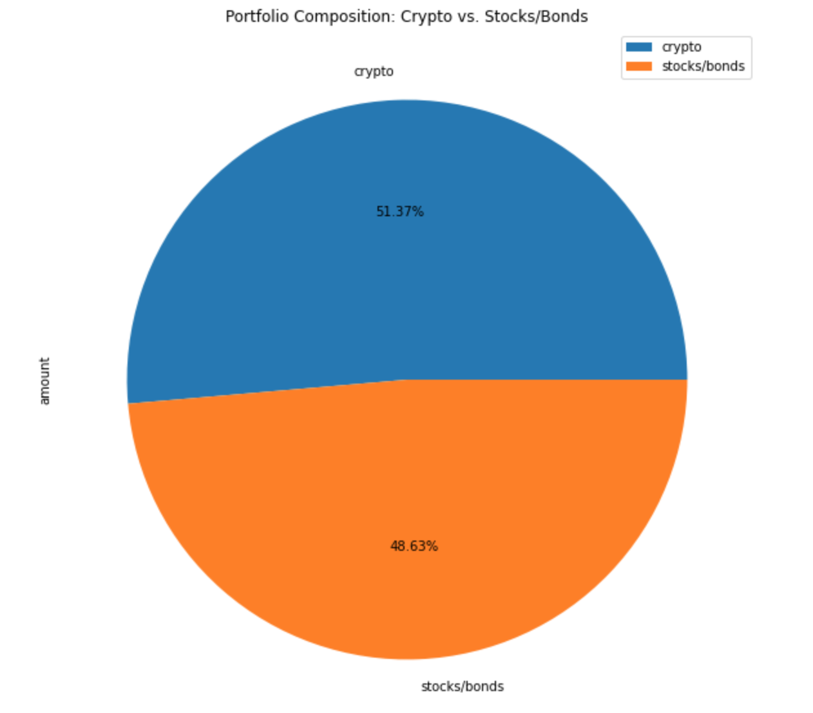
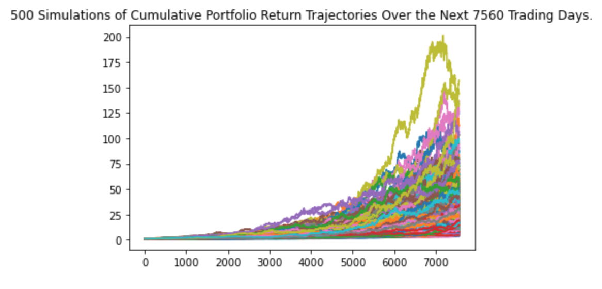
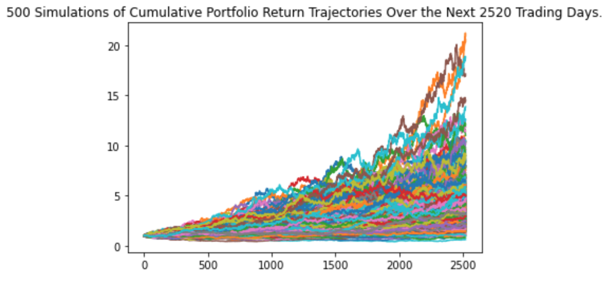

# Financial Planner with Monte Carlo Simulations

`This project uses Monte Carlo Simulations to evaluate credit union members' financial health by creating a financial plan for budgeting and retirement.`

---

## Description

In this project, I’ll create two financial analysis tools by using a single Jupyter notebook. In "Part 1" I will create a financial planner for emergencies. The members will be able to use this tool to visualize their current savings. The members can then determine if they have enough reserves for an emergency fund. In "Part 2" I will create a financial planner for retirement. This tool will forecast the performance of their retirement portfolio in 30 years. To do this, the tool will make an Alpaca API call via the Alpaca SDK to get historical price data for use in Monte Carlo simulations.

---

## Technologies

This project leverages python 3.7 with the following packages:

* [pandas](https://github.com/pandas-dev/pandas) - For reading data into a DataFrame.

* [matplotlib](https://matplotlib.org/stable/users/index.html) - For embedding plots in the application.

* [numpy](https://github.com/numpy/numpy) - For scientific computing in Python.

* [os](https://docs.python.org/3/library/os.html) - For providing a portable way of using operating system dependent functionality.

* [datetime](https://docs.python.org/3/library/datetime.html) - For supplying classes for manipulating dates and times.

* [json](https://docs.python.org/3/library/json.html) - For data interchange.

* [requests](https://docs.python-requests.org/en/master/index.html) - For sending HTTP/1.1 requests.

* [dotenv](https://pypi.org/project/python-dotenv/) - For reading key-value pairs from a .env file and setting them as environment variables.

* [alpaca_trade_api](https://alpaca.markets/docs/api-documentation/) - For collecting relevant price data from Alpaca Trade API.

* [pytz](https://pypi.org/project/pytz/) - For accurate timezone calculations.

---

## Installation Guide

Before running the application first install the following dependencies:

```python
  pip install pandas
  pip install mkdocs
  pip install numpy
  pip install requests
  pip install python-dotenv
  pip install alpaca-trade-api
```

---

## Usage

To use the Portfolio Optimizer:

1. Locally clone the monte_carlo_financial_planner repository from GitHub using the following link:

```python
git clone https://github.com/elliotlozano/monte_carlo_financial_planner.git
```

2. Create an environment (.env) file with your ALPACA_API_KEY and ALPACA_SECRET_KEY in the same folder as financial_planning_tools.ipynb.

3. Run the [Monte Carlo Financial Planner](financial_planning_tools.ipynb) program.

4. Examine the graphs and review the commentary describing the significance of the results.

---

## Findings

The following visuals helped evaluate the union members' portfolios.


`The pie chart shows the percent composition of assets within the client's portfolio. This particular client has 51.37% of their portfolio invested in cryptocurrencies (BTC and ETH) and 48.63% invested in stocks and bonds. The total value of the portfolio at the time of analysis was around 150,000 dollars.`


`This Monte Carlo simulation generates 500 instances of cumulative returns for the next 30 years. The portfolio is weighted at 60% stocks (SPY) and 40% bonds (AGG). The value of the portfolio is projected to fall between $412,703.59 and $6,807,224.78.`


`This Monte Carlo simulation generates 500 instances of cumulative returns for the next 10 years. The portfolio is weighted at 80% stocks (SPY) and 20% bonds (AGG). The value of the portfolio is projected to fall between $96,041.00 and $751,740.29.`

---

## Contributors

Elliot Lozano

[E-mail](elliotlozano95@gmail.com)

---

## License

MIT